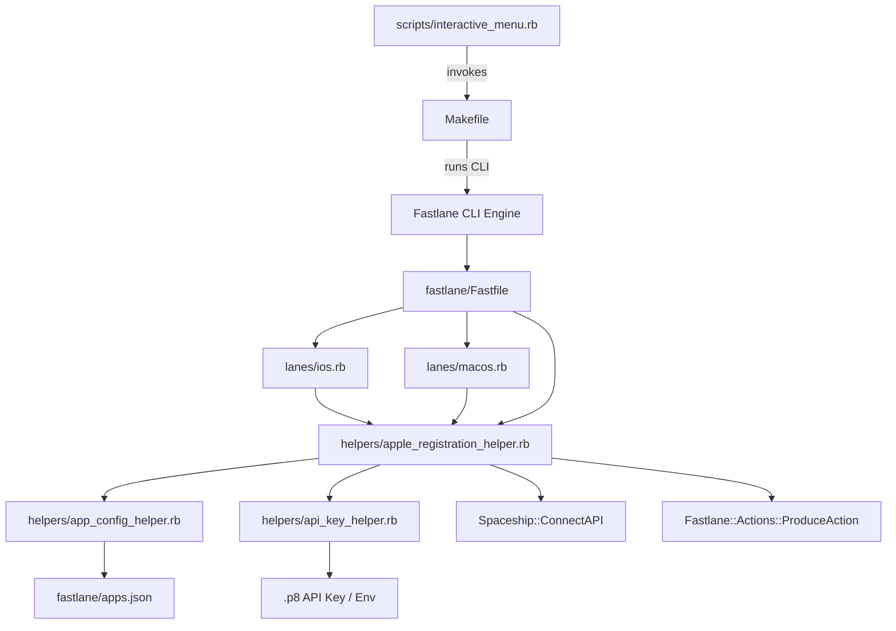

# Component Dependency Graph

## Dependency Rules
1. **Unidirectional flow**: High-level CLI entrypoints call Fastlane, which calls helpers. Helpers do not call entrypoints.
2. **Helper re-use**: Both `ios.rb` and `macos.rb` depend on `apple_registration_helper.rb` to prevent duplicate Spaceship code.
3. **Configuration isolation**: `apps.json` remains the single data model source.
