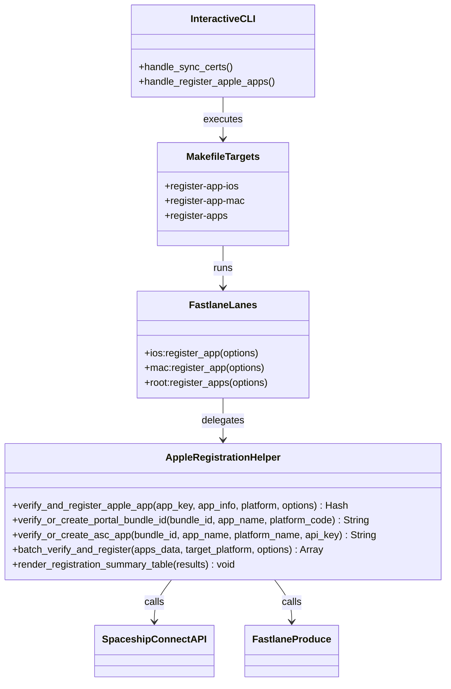

# Application Components Design

## 1. Components Overview

### Component 1: `AppleRegistrationHelper` (`fastlane/helpers/apple_registration_helper.rb`)
- **Responsibility**: Encapsulates all query and mutation logic communicating with Apple Developer Portal and App Store Connect.
- **Key Characteristics**:
  - Stateless helper methods.
  - Safe error recovery (captures name collisions and API warnings without crashing batch runs).
  - Terminal output formatting with status emojis (`[EXISTS]`, `[CREATED]`, `[FAILED]`).

### Component 2: `FastlaneLanes` (`fastlane/lanes/ios.rb`, `macos.rb`, `Fastfile`)
- **Responsibility**: Defines the Fastlane user-facing interface, validates parameters, and orchestrates executions.

### Component 3: `InteractiveCLI` (`scripts/interactive_menu.rb`)
- **Responsibility**: Provides prompt-driven interaction in terminal for human operators.

### Component 4: `MakefileTargets` (`Makefile`)
- **Responsibility**: Standardizes CLI command invocations for developers and automated CI scripts.
