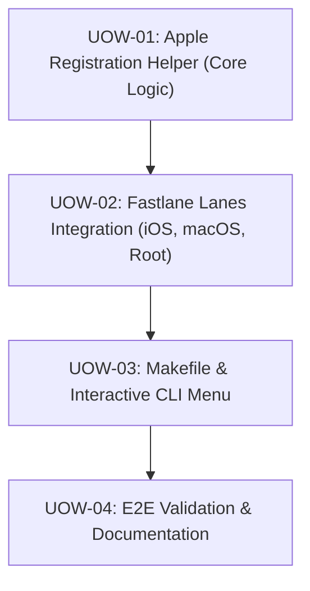

# Unit of Work Dependency

## Construction Order
1. **UOW-01**: Build helper logic first so that lanes have tested underlying functions to invoke.
2. **UOW-02**: Integrate into Fastlane lanes, validating both single app and batch runs.
3. **UOW-03**: Wrap lanes with Makefile targets and Interactive CLI menu.
4. **UOW-04**: Complete documentation and dry run validation.
