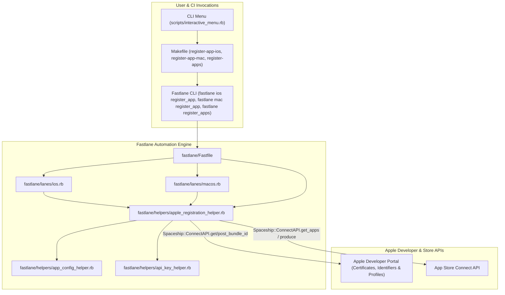
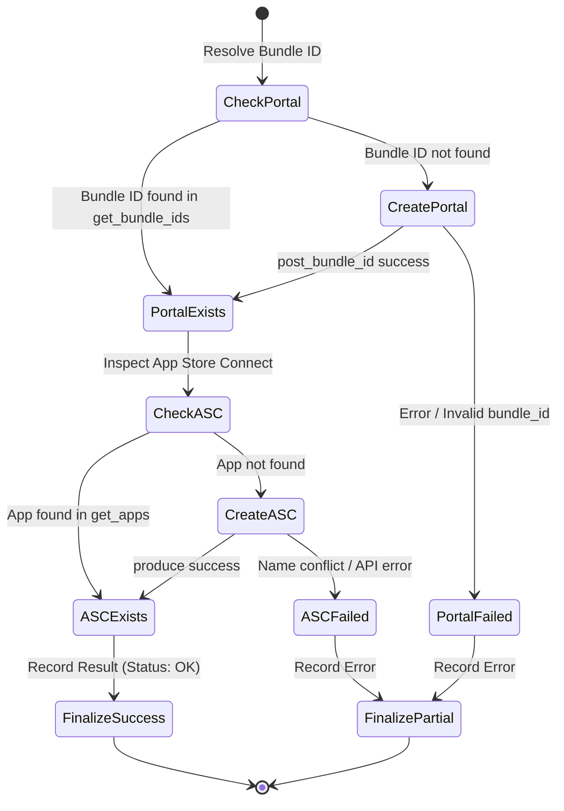

# Detailed Design Baseline

## Executive Summary
This document establishes the official Detailed Design Baseline for the automated **Apple Identifiers** (`https://developer.apple.com/account/resources/identifiers/list`) and **App Store Connect Applications** (`https://appstoreconnect.apple.com/apps`) verification and registration feature in `thanhlv-fastlane`.

This baseline marks the conclusion of the **Inception Phase** and serves as the authoritative blueprint for the **Construction Phase**.

---

## 1. System Context & Architecture



---

## 2. Component Ownership & Directory Manifest

| Component | Physical File | Ownership & Responsibilities |
|---|---|---|
| **Registration Helper** | [`fastlane/helpers/apple_registration_helper.rb`](file:///Users/le.van.thanh/Documents/project/thanhlv/thanhlv-fastlane/fastlane/helpers/apple_registration_helper.rb) | Implements two-step check-and-create logic for Developer Portal and App Store Connect, batch iteration, and summary reporting. |
| **Fastlane Root Lanes** | [`fastlane/Fastfile`](file:///Users/le.van.thanh/Documents/project/thanhlv/thanhlv-fastlane/fastlane/Fastfile) | Imports helper and defines multi-platform coordinator lane `register_apps`. |
| **iOS Platform Lane** | [`fastlane/lanes/ios.rb`](file:///Users/le.van.thanh/Documents/project/thanhlv/thanhlv-fastlane/fastlane/lanes/ios.rb) | Exposes `register_app` supporting single app and batch (`app:all`) for iOS. |
| **macOS Platform Lane** | [`fastlane/lanes/macos.rb`](file:///Users/le.van.thanh/Documents/project/thanhlv/thanhlv-fastlane/fastlane/lanes/macos.rb) | Exposes `register_app` supporting single app and batch (`app:all`) for macOS. |
| **Build Targets** | [`Makefile`](file:///Users/le.van.thanh/Documents/project/thanhlv/thanhlv-fastlane/Makefile) | Provides targets `register-app-ios`, `register-app-mac`, and `register-apps`. |
| **Interactive Menu** | [`scripts/interactive_menu.rb`](file:///Users/le.van.thanh/Documents/project/thanhlv/thanhlv-fastlane/scripts/interactive_menu.rb) | Provides interactive CLI selection wizard under Certificates & Apple Management. |

---

## 3. Data Models & API Contracts

### App Configuration Schema (`fastlane/apps.json`)
The registration engine reads each application definition:
```json
{
  "app_key": {
    "app_name": "OpsFlow Hub",
    "bundle_id": "com.thanhlv.opsflow",
    "platforms": ["ios", "macos"],
    "platforms_config": {
      "macos": {
        "bundle_id": "com.thanhlv.opsflow.mac"
      }
    },
    "extensions": [
      {
        "bundle_id": "com.thanhlv.opsflow.OneSignalNotificationServiceExtension",
        "name": "OpsFlow OneSignal Notification Service Extension"
      }
    ],
    "app_groups": ["group.com.thanhlv.opsflow"]
  }
}
```

### Apple API Integration Details
- **Authentication**: `api_key = get_api_key` initializing `Spaceship::ConnectAPI.token`.
- **Developer Portal Verification (`https://developer.apple.com/account/resources/identifiers/list`)**:
  - Request: `Spaceship::ConnectAPI.get_bundle_ids(filter: { identifier: bundle_id })`
  - Creation if missing:
    - Platform code: `IOS` (for iOS) or `MAC_OS` (for macOS).
    - Request: `Spaceship::ConnectAPI.post_bundle_id(name: app_name, identifier: bundle_id, platform: platform_code)`
- **App Store Connect Verification (`https://appstoreconnect.apple.com/apps`)**:
  - Request: `Spaceship::ConnectAPI.get_apps(filter: { bundleId: bundle_id })`
  - Creation if missing:
    - Fastlane `produce(api_key: api_key, app_identifier: bundle_id, app_name: app_name, platform: platform_name, skip_devcenter: true)`

---

## 4. State Transitions & Verification Workflow



---

## 5. Failure & Recovery Mechanisms

1. **Pre-existing Identifiers or Apps**:
   - Condition: Identifier or App already registered.
   - Action: Intercepted during GET queries, logs informational notice `[EXISTS]`, skips creation, continues execution without exception.
2. **App Store Connect App Name Collision**:
   - Condition: `app_name` in `apps.json` is already registered globally on App Store Connect by another developer team.
   - Action: Intercepted, logs specific warning with remediation hint (`"Tên app '#{app_name}' đã bị trùng lặp trên App Store Connect"`), flags status as `FAILED`, and continues remaining apps in batch mode.
3. **Missing ASC Credentials**:
   - Condition: Missing `AuthKey_*.p8` or `ASC_ISSUER_ID`.
   - Action: Pre-flight check via `get_api_key` halts early with clear configuration instructions before making network requests.

---

## 6. Security & Credential Hygiene
- All Apple operations require App Store Connect API Key (`.p8`) credentials.
- In-memory decryption from encrypted Git keystore (`MATCH_GIT_URL` via `MATCH_PASSWORD`) or CI environment variables (`ASC_KEY_CONTENT`).
- No plain-text keys are stored on disk or committed to Git.

---

## 7. Test & Verification Design

1. **Syntax & Unit Sanity**:
   - `ruby -c fastlane/helpers/apple_registration_helper.rb`
   - `ruby -c fastlane/lanes/ios.rb`
   - `ruby -c fastlane/lanes/macos.rb`
   - `ruby -c scripts/interactive_menu.rb`
2. **Mock / Dry-Run Verification**:
   - Verify bundle ID resolution for all 11 apps across iOS and macOS platforms.
   - Verify batch filtering logic excludes non-Apple platforms (`android`, `windows`, `linux`).
3. **Interactive Menu Usability**:
   - Execute `./menu.sh` to test menu rendering, option selection, and command formulation.

---

## 8. Requirements Traceability Matrix (RTM)

| Requirement ID | Description | Component | Verification Method |
|---|---|---|---|
| **FR-01** | Developer Portal Identifier check & registration | `apple_registration_helper.rb` | Spaceship ConnectAPI query & post |
| **FR-02** | App Store Connect App check & registration | `apple_registration_helper.rb` | Spaceship ConnectAPI query & produce |
| **FR-03** | Multi-Platform (iOS & macOS) Support | `ios.rb`, `macos.rb`, `apple_registration_helper.rb` | Platform mapping (`IOS`, `MAC_OS`, `osx`) |
| **FR-04** | Single-App & Batch (`APP=all`) Execution | `Fastfile`, `Makefile` | Batch iterator & Summary Table |
| **FR-05** | Idempotency & Fault Tolerance | `apple_registration_helper.rb` | Safe error rescue and status logging |
| **FR-06** | Secondary Identifiers (Extensions/Groups) | `apple_registration_helper.rb` | Extension array iteration |
| **FR-07** | Makefile & Interactive CLI Menu Integration | `Makefile`, `scripts/interactive_menu.rb` | CLI test execution |
| **NFR-01** | Credential Security | `api_key_helper.rb` | ASC API Key validation |
| **NFR-03** | Terminal Usability & Formatting | `apple_registration_helper.rb` | Terminal::Table rendering |
