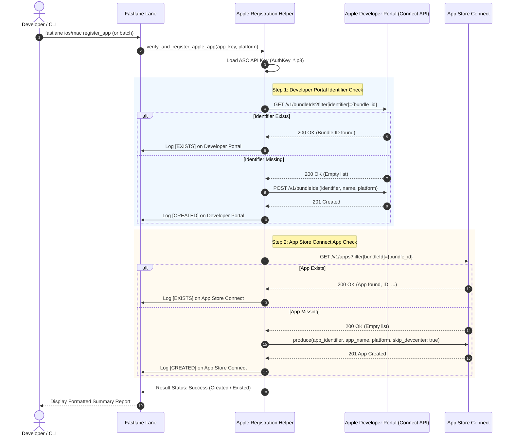

# Functional Specification Document (FSD)

## Feature: Automated Apple Identifiers & App Store Connect App Verification and Registration

---

## 1. System Overview & Context

This feature provides automated, idempotent verification and creation of:
1. **Apple Developer Portal Identifiers (App IDs / Bundle IDs)**: Located in the Apple Developer Center at `https://developer.apple.com/account/resources/identifiers/list`.
2. **App Store Connect Applications**: Located in App Store Connect at `https://appstoreconnect.apple.com/apps`.

### High-Level Workflow Diagram



---

## 2. Functional Decomposition

### 2.1 Identifier Verification & Registration Flow (`Step 1`)
1. **Resolve Bundle ID**: Obtain `bundle_id` from `fastlane/apps.json` based on the targeted platform (`ios` or `macos`).
2. **Authentication**: Authenticate using `Spaceship::ConnectAPI.token = get_api_key`.
3. **Query Bundle IDs**:
   - Call `Spaceship::ConnectAPI.get_bundle_ids(filter: { identifier: bundle_id })`.
   - If returned collection contains matching `identifier`:
     - Mark status as `EXISTS`.
     - Output: `ℹ️ [EXISTS] Identifier #{bundle_id} is already registered on Developer Portal.`
   - If returned collection is empty:
     - Determine platform type: `IOS` for iOS, `MAC_OS` for macOS.
     - Call `Spaceship::ConnectAPI.post_bundle_id(name: app_name, identifier: bundle_id, platform: platform_code)`.
     - Mark status as `CREATED`.
     - Output: `🎉 [CREATED] Successfully registered Identifier #{bundle_id} on Apple Developer Portal.`
4. **Secondary Identifiers** (if configured):
   - For each extension in `app_info["extensions"]` or `app_info["app_groups"]`:
     - Repeat verification and creation logic.

### 2.2 App Store Connect App Verification & Creation Flow (`Step 2`)
1. **Query Existing Apps**:
   - Call `Spaceship::ConnectAPI.get_apps(filter: { bundleId: bundle_id })`.
   - If returned collection contains an app record:
     - Mark status as `EXISTS`.
     - Output: `ℹ️ [EXISTS] App '#{app_name}' (ID: #{app.id}) already exists on App Store Connect.`
   - If returned collection is empty:
     - Invoke Fastlane `produce`:
       ```ruby
       produce(
         api_key: api_key,
         app_identifier: bundle_id,
         app_name: app_name,
         language: "English",
         platform: (platform == "macos" ? "osx" : "ios"),
         skip_devcenter: true # DevCenter was already ensured in Step 1
       )
       ```
     - Mark status as `CREATED`.
     - Output: `🎉 [CREATED] Successfully created App '#{app_name}' on App Store Connect.`

### 2.3 Batch Execution & Reporting
When invoked with `app:all` or `APP=all`:
1. Find all apps in `apps.json` having `ios` or `macos` in `platforms`.
2. Execute verification and registration sequentially.
3. Catch any single-app exceptions (such as name collision or network timeout), log error details, and record status as `FAILED`.
4. Render a Fastlane summary table:
```
+--------------------+----------+-----------------------+-------------------+-------------------+
| App Key            | Platform | Bundle ID             | Dev Portal        | App Store Connect |
+--------------------+----------+-----------------------+-------------------+-------------------+
| OpsFlow_Hub        | ios      | com.thanhlv.opsflow   | EXISTS (Skipped)  | EXISTS (Skipped)  |
| dem-tien-china     | ios      | com.thanhlv.demtien   | CREATED           | CREATED           |
| dem-tien-china     | macos    | com.thanhlv.demtien   | CREATED           | CREATED           |
+--------------------+----------+-----------------------+-------------------+-------------------+
```

---

## 3. CLI & Build Integration

### 3.1 Fastlane Lanes
- `fastlane ios register_app app:<app_key|all>`
- `fastlane mac register_app app:<app_key|all>`
- `fastlane register_apps [app:<app_key|all>] [platform:<ios|macos|all>]`

### 3.2 Makefile Targets
```makefile
## Đăng ký & kiểm tra Bundle ID và App trên Apple Developer Portal & ASC cho iOS
register-app-ios:
	fastlane ios register_app app:$${APP:-all}

## Đăng ký & kiểm tra Bundle ID và App trên Apple Developer Portal & ASC cho macOS
register-app-mac:
	fastlane mac register_app app:$${APP:-all}

## Đăng ký & kiểm tra tất cả các apps trên cả iOS và macOS
register-apps:
	fastlane register_apps app:$${APP:-all} platform:$${PLATFORM:-all}
```

### 3.3 Interactive CLI Menu (`scripts/interactive_menu.rb`)
- Insert new action under `handle_sync_certs`:
  - `🍎 Kiểm tra & Đăng ký Apple Identifiers & App Store Connect App`
- Prompts user to select:
  1. Platform (`iOS`, `macOS`, `Tất cả các nền tảng Apple`)
  2. App Key (`Tất cả các apps` or a specific app from list)
- Executes corresponding `make register-apps` command with clean terminal output.

---

## 4. Error Handling & Edge Cases

| Scenario | System Behavior | User Notification |
|---|---|---|
| Identifier already exists on Developer Portal | Skip creation gracefully | `[EXISTS] Identifier #{bundle_id} already exists` |
| App already exists on App Store Connect | Skip creation gracefully | `[EXISTS] App '#{app_name}' already exists` |
| App name already taken by another developer on ASC | Mark ASC status as FAILED, continue batch | `[FAILED] Name '#{app_name}' already taken. Update app_name in apps.json` |
| Invalid / Expired ASC API Key | Fail early before processing apps | `[ERROR] Unable to authenticate with App Store Connect API Key` |
| App does not support target platform | Skip with notice | `[SKIPPED] App does not target platform #{platform}` |
