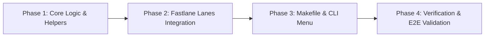

# Execution Plan

## 1. Overview
This execution plan decomposes the construction and rollout of the Apple Identifiers & App Store Connect App Verification and Registration feature into sequential, testable phases.

## 2. Implementation Phases

### Phase 1: Core Logic & Helpers (`helpers/apple_registration_helper.rb` or `cert_helper.rb`)
- Implement `verify_and_register_apple_app(app_key, app_info, platform, options)`:
  - Query Developer Portal Bundle IDs (`Spaceship::ConnectAPI.get_bundle_ids`).
  - Register missing Bundle ID (`Spaceship::ConnectAPI.post_bundle_id`).
  - Query App Store Connect Apps (`Spaceship::ConnectAPI.get_apps`).
  - Create missing App Store Connect App (`produce`).
  - Support secondary identifiers (extensions, app groups).
  - Return structured status object (`{ portal_status: ..., asc_status: ..., bundle_id: ... }`).

### Phase 2: Fastlane Lanes Integration
- Update `fastlane/lanes/ios.rb`:
  - Enhance `lane :register_app` to support single app and `app:all`.
- Update `fastlane/lanes/macos.rb`:
  - Enhance `lane :register_app` to support single app and `app:all`.
- Add root lane to `fastlane/Fastfile`:
  - `lane :register_apps`: coordinates batch registration across platforms and formats summary table.

### Phase 3: Makefile & CLI Menu Integration
- Update `Makefile`:
  - Update `register-app-ios` and `register-app-mac` to allow optional `APP` (defaults to all).
  - Add `register-apps` target with `APP` and `PLATFORM` arguments.
- Update `scripts/interactive_menu.rb`:
  - Add `handle_register_apple_apps` in the Certificates / Apple management submenu.
  - Implement interactive platform selection and app selection prompts.

### Phase 4: Verification & E2E Validation
- Unit / Mock verification of helper logic.
- Dry-run / Syntax check of Ruby scripts (`ruby -c`).
- Test interactive menu flow navigation.
