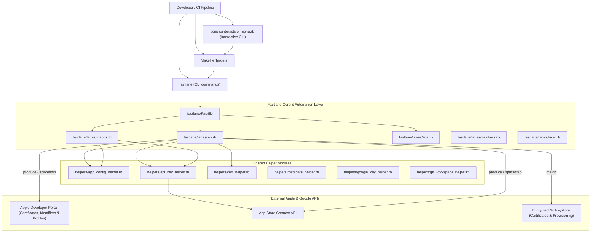

# System Architecture

## Architecture Diagram

## Layer Responsibilities
1. **Entrypoints**:
   - `scripts/interactive_menu.rb`: Ruby terminal UI for interactive option selection.
   - `Makefile`: Shell commands standardizing lane invocations with parameters.
   - Fastlane lanes: Individual task runners.
2. **Configuration & Data**:
   - `fastlane/apps.json`: Single source of truth for app metadata (bundle IDs, package names, git URLs, platforms, build numbers).
   - `.env`: Environment variables (API Key ID, Issuer ID, Match Git URL, passwords).
3. **Execution Engine**:
   - Fastlane actions (`produce`, `match`, `gym`, `deliver`, `pilot`).
   - Spaceship / App Store Connect API integration.
